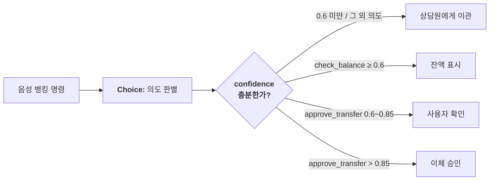

# Jev 환경 설정 및 활용 가이드

> **작성 기준일:** 2026-09-27
> **대상:**  <br>TypeSafe AI의 System One 모델 **Jev** 를 처음 설정하고 업무 시스템에 적용하려는 개발자 <br>
> **출처:**  <br>[docs.typesafe.ai](https://docs.typesafe.ai/) 공식 문서 (models / api / sdk / confidence / model-jaggedness) <br>
> **이 문서는 로컬 실행 가이드가 아니라 "호스팅 API 연동" 가이드입니다.**  <br>Jev는 오픈소스 가중치를 배포하지 않으며 로컬/프라이빗 설치 옵션이 없습니다.  <br>
> 모든 사용은 `api.typesafe.ai` 엔드포인트로 이루어집니다.

---

## 목차

1. [Jev란 무엇인가](#1-jev란-무엇인가)
2. [핵심 개념: State와 3가지 Primitive](#2-핵심-개념-state와-3가지-primitive)
3. [사전 준비: 계정 · API 키 · 요금](#3-사전-준비-계정--api-키--요금)
4. [환경 변수 설정](#4-환경-변수-설정)
5. [SDK 설치](#5-sdk-설치)
6. [첫 호출 실습](#6-첫-호출-실습)
7. [API 레퍼런스](#7-api-레퍼런스)
8. [모델 관리와 버전 고정](#8-모델-관리와-버전-고정)
9. [Confidence 완전 정리](#9-confidence-완전-정리)
10. [실전 활용 패턴 7가지](#10-실전-활용-패턴-7가지)
11. [비용 · 성능 최적화](#11-비용--성능-최적화)
12. [에러 처리와 재시도](#12-에러-처리와-재시도)
13. [모델의 한계 (Jaggedness 9가지)](#13-모델의-한계-jaggedness-9가지)
14. [자주 하는 실수 정리](#14-자주-하는-실수-정리)
15. [전체 셋업 체크리스트](#15-전체-셋업-체크리스트)
16. [참고 링크](#16-참고-링크)

---

## 1. Jev란 무엇인가

### 1.1 핵심 정의

LLM은 **사람이 읽을 텍스트를 생성**하도록 설계되어 있습니다. 하지만 실제로 필요한 것은 종종 *"코드가 소비할 수 있는 형태의 판단"* 입니다. 이 불일치를 해결하기 위해 Jev는 텍스트를 생성하지 않고, **타입이 지정된 질문(typed question)에 대해 구조화된 답변**을 직접 반환합니다.

```
state + questions  ──▶  [ Jev 모델 ]  ──▶  typed answers
                                            + probabilities
                                            + confidence
                                                   │
                                                   ▼
                                          코드가 분기·정렬·라우팅
```

### 1.2 일반 LLM과의 결정적 차이

| 구분 | 일반 LLM | Jev |
|---|---|---|
| 출력 형태 | 자유 텍스트 | 정해진 스키마(JSON) |
| 파싱 |正则/프롬프트로 파싱 필요 | **파싱 불필요** |
| 불확실성 | 없음 (그럴듯하게 생성) | `probabilities` + `confidence` 수치 제공 |
| 이유 설명 | 가능 | **불가** (생성 모델이 아님) |
| 속도 | 수 초~수십 초 | 수십~수백 ms 수준 |
| 비용 | 입력+출력 과금 | **입력만 과금, 출력 무료** |

### 1.3 세 가지 사용 방식

1. **Playground** — 브라우저에서 코드 없이 먼저 검증 (가장 빠른 학습 경로)
2. **HTTP API** — `POST https://api.typesafe.ai/v1/systemone` 직접 호출
3. **공식 SDK** — Python `typesafe-sdk` / JavaScript `@typesafe-ai/sdk`

추가로 **Agent Skill** 을 설치하면 Claude Code·Codex 같은 코딩 에이전트가 Jev 사용법을 스스로 학습합니다.

---

## 2. 핵심 개념: State와 3가지 Primitive

### 2.1 State — 평가 대상

`state` 는 "판단하게 할 내용"입니다. 세 가지 형태를 지원합니다.

| 형태 | 적합한 상황 | 예시 |
|---|---|---|
| `string` | 단순 텍스트 1건 | `"카드가 이중으로 결제됐습니다."` |
| `object` | 명명된 필드, 연관 레코드 (대부분의 경우) | `{"message": "...", "order_id": "A-104"}` |
| `array` | 메시지 시퀀스, 문서 목록 | `["안녕하세요", "고객번호는 TS1337입니다", ...]` |

> **주의**
> - **텍스트만** 지원합니다. 이미지·오디오·비디오는 아직 미지원 → 사전에 텍스트로 변환해 `state` 에 넣어야 합니다.
> - 영어가 주 훈련 언어이며 정확도가 가장 높습니다. **한국어를 포함한 CJK 언어는 지원되지만 정확도가 낮습니다.** 한국어 업무에 적용하기 전에 반드시 자체 데이터로 평가하고 `confidence` 분기를 반드시启用하세요.
> - state가 커질수록 **context rot(무관 정보로 인한 정확도 저하)** 가 발생합니다. 질문에 필요한 필드만 골라서 보냅니다.

구조화된 state 예시:

```json
{
  "ticket": {
    "subject": "중복 결제",
    "messages": [
      { "from": "customer", "text": "주문 A-104가 이중 결제됐습니다. 환불해 주세요." },
      { "from": "support", "text": "결제 내역을 확인 중입니다." }
    ]
  },
  "order": {
    "id": "A-104",
    "charges": [
      { "amount_krw": 65000, "status": "captured" },
      { "amount_krw": 65000, "status": "captured" }
    ]
  },
  "refund_policy": "중복 결제는 환불 대상이다."
}
```

### 2.2 Primitive — 질문의 3가지 타입

세 타입 모두 **1회의 요청에 혼합해서** 보낼 수 있고, 각 질문은 같은 state에 대해 **병렬·독립적으로** 평가됩니다. 즉 질문 10개를 추가해도 응답 시간은 거의 늘지 않고, 질문이 많아져도 서로 간섭하지 않습니다.

| Primitive | 목적 | 반환 필드 |
|---|---|---|
| **Choice** | 목록에서 하나 선택 | `choice`, `probabilities`, `confidence` |
| **Score** | 순서 있는 등급으로 평가 | `score`, `legend`, `probabilities`, `confidence` |
| **Noul** | 이 명제가 참인가 (예/아니오) | `noul` (0~1) — **`confidence` 없음** |

#### Choice (선택형)

```json
{
  "department": {
    "type": "choice",
    "instructions": "이 문의를 어떤 팀이 처리해야 하는가?",
    "criteria": {
      "billing": "결제, 구독, 환불 관련 문의",
      "technical": "버그, 연동 실패, 장애 관련 문의",
      "sales": "가격, 업그레이드, 신규 계약 관련 문의",
      "other": "위 어느 것에도 해당하지 않거나 정보가 부족함"
    }
  }
}
```

- **최대 255개** 옵션
- `criteria` 는 `null` 허용 (설명이 필요 없는 옵션)
- `other` 류의 **포괄 옵션을 반드시 포함**하세요. 선택지 집합이 불완전하면 그 외 답이 표현되지 못합니다.

#### Score (평점형)

```json
{
  "frustration": {
    "type": "score",
    "instructions": "고객의 좌절감 수준은 어느 정도인가?",
    "criteria": [
      "차분하게 사실만 전달함",
      " frustated하지만 예의 바름",
      "화가 나 있고 강한 언어를 사용함"
    ]
  }
}
```

- 등급은 **최소 2개, 최대 10개**이며 **순서가 의미 있음** (인덱스가 곧 서열)
- 등급은 "약간/매우" 같은 모호한 표현보다 **구체적 상황 묘사**로 정의할 것
- `score` 는 확률 가중 평균이라 등급 **사이에** 떨어질 수 있습니다 (예: `1.05`)
- `confidence` 가 낮으면 → "등급 자체가 모호하거나 다차원적이어서 state 정보가 부족하다"는 신호입니다

#### Noul (참/거짓형)

```json
{
  "is_urgent": {
    "type": "noul",
    "instructions": "이 문의가 시간적 긴급성을 내비친다",
    "criteria": {
      "true": "명시적인 시간 압박 표현이 있음",
      "false": "긴급성 표현이 없음"
    }
  }
}
```

- `noul` 값이 **"yes일 확률"** 입니다. 0.95면 "yes에 95% 가깝다"는 뜻
- `criteria` 는 선택 사항이지만, `true`/`false` 의미를 명시하면 정확도가 올라갑니다
- **`confidence` 필드가 없습니다.** noul 값 자체가 곧 확신의 정도이므로, 별도 `confidence` 판단 로직을 넣지 마세요

### 2.3 원자적 질문 원칙 (가장 중요)

> **복합 판단을 하나의 질문에 넣지 마세요.**

System One 모델은 "몇 초 안에 내릴 수 있는, 범위가 좁고 잘 정의된 판단"에서 가장 강합니다.

```
❌ 나쁜 예: "이 스타트업 피치를 10점 만점으로 평가하라"
✅ 좋은 예: "시장 규모는 얼마나 큰가?" (Score)
           "기술적 실현 가능성은?" (Score)
           " 차별화 요소는 명확한가?" (Noul)
           → 세 점수를 코드에서 내 가중치로 합산
```

**이유:** 우선순위가 바뀌면 코드의 계수 하나만 고치면 되므로, 프롬프트를 다시 쓰지 않고 임계값 조정이 가능합니다. 또 각 판단을 독립 검증할 수 있어 감사(audit) 가능성이 생깁니다.

---

## 3. 사전 준비: 계정 · API 키 · 요금

### 3.1 가입 및 API 키 발급

1. <https://console.typesafe.ai> 에서 로그인 또는 신규 가입
2. 좌측 메뉴 **API Keys** (또는 <https://console.typesafe.ai/keys>) 이동
3. **Create key** 클릭 → 생성된 키를 즉시 복사
   - 키는 **`ts-` 로 시작**하며, **표시는 단 한 번만** 됩니다. 잃어버리면 재발급해야 합니다.
4. **Settings → Billing** 에서 크레딧 잔액 확인
   - 신규 계정에는 무료 크레딚이 부여되는 경우가 있습니다 (2026-09 기준 신규 계정 $5 / 1개월, 콘솔에서 개별 확인 권장)

### 3.2 요금 (2026-09-27 기준)

| 항목 | 값 |
|---|---|
| 과금 단위 | **입력 토큰만** 과금 (Btok = 10억 토큰, Mtok = 100만 토큰) |
| 가격 | **$42 / Btok**  =  **$0.042 / Mtok** |
| 출력 토큰 | **무료** |

> 입력 토큰 100만 개당 약 $0.042. 예시: state 500토큰 + 질문 3개(약 150토큰) = 1회 호출 약 650토큰 → 약 1회당 $0.000027. 새 계정 $5 크레딧이면 대략 18만 회 호출 가능 (실제는 질문 구성에 따라 달라짐).

### 3.3 속도·컨텍스트 한도

| 항목 | 값 |
|---|---|
| Rate limit | **초당 250,000 토큰** 또는 **분당 1,200 요청** |
| Context length | **1회 요청 64k 토큰** (state + 전체 질문 합산) |
| state 한도 | **state + 가장 긴 질문 1개 합산 32k 토큰** |
| 입력 모달리티 | 텍스트만 (문자열, JSON 객체, 텍스트 배열) |

> ⚠️ **Rate limit은 동적으로 조정됩니다.** 현재 매우 높은 수요를 처리 중이라 예고 없이 바뀔 수 있습니다. 커스텀/엔터프라이즈 플랜에서 상한 상향 가능 (`sales@typesafe.ai`).
> 상한 어느 쪽을 초과하면 `429 Too Many Requests`가 반환됩니다.

---

## 4. 환경 변수 설정

### 4.1 참고: SDK가 읽는 환경 변수

| 변수 | 역할 | 기본값 |
|---|---|---|
| `TYPESAFE_API_KEY` | API 키 (**필수**) | — |
| `TYPESAFE_BASE_URL` | API 루트 URL | `https://api.typesafe.ai` |
| `TYPESAFE_DEFAULT_MODEL` | 기본 모델 | `jev-latest` |
| `TYPESAFE_LOG_LEVEL` | `typesafe_sdk` 로거 레벨 (import 시 1회 적용) | 미설정 |

> **키 처리 규칙 (Python SDK)**
> - 앞뒤 공백 및 파일의 개행 문자는 자동 strip 됩니다.
> - 빈 키, 내부 공백, 제어문자, 비ASCII 문자는 **요청 전에 거부**됩니다.
> - 명시적으로 빈 키를 넣으면 환경 변수로 fallback 하지 않습니다.
> - 잘못된 키는 클라이언트 생성 시점에 `TypeSafeError`로 즉시 실패합니다 (네트워크 요청 전).

### 4.2 Windows PowerShell — 현재 세션 한정

```powershell
$env:TYPESAFE_API_KEY = "ts-xxxxxxxxxxxxxxxx"
$env:TYPESAFE_LOG_LEVEL = "info"
$env:TYPESAFE_DEFAULT_MODEL = "jev-1.13.0"
```

### 4.3 Windows PowerShell — 영구 설정 (사용자 수준)

`setx`로 저장하면 **새로 연 모든 터미널/에디터에 적용**됩니다. 현재 세션에도 즉시 반영하려면 둘 다 실행하세요.

```powershell
setx TYPESAFE_API_KEY "ts-xxxxxxxxxxxxxxxx"
setx TYPESAFE_DEFAULT_MODEL "jev-latest"
setx TYPESAFE_LOG_LEVEL "warning"

# 현재 세션에도 반영
$env:TYPESAFE_API_KEY = "ts-xxxxxxxxxxxxxxxx"
```

- 사용자 범위 저장 위치: `HKCU\Environment`
- 확인: `[Environment]::GetEnvironmentVariable("TYPESAFE_API_KEY", "User")`
- 제거: `Remove-Item Env:\TYPESAFE_API_KEY` (현재 세션), `setx TYPESAFE_API_KEY ""` (영구)

> `setx`는 값을 레지스트리에 평문으로 저장합니다. **공용 PC나 워크스테이션 공유 환경에서는 이 방법을 피하고** §4.5의 시크릿 관리자를 사용하세요.

### 4.4 macOS / Linux / WSL

```bash
# 현재 세션
export TYPESAFE_API_KEY="ts-xxxxxxxxxxxxxxxx"

# 영구 설정 (~/.bashrc 또는 ~/.zshrc 에 추가)
echo 'export TYPESAFE_API_KEY="ts-xxxxxxxxxxxxxxxx"' >> ~/.bashrc
source ~/.bashrc
```

### 4.5 권장: 프로젝트 `.env` + 시크릿 관리자

Git에 키가 커밋되는 사고를 가장 확실히 막는 방법입니다.

**`.env` 생성**

```dotenv
TYPESAFE_API_KEY=ts-xxxxxxxxxxxxxxxx
TYPESAFE_BASE_URL=https://api.typesafe.ai
TYPESAFE_DEFAULT_MODEL=jev-latest
```

**`.gitignore` 반드시 추가**

```gitignore
.env
.env.*
!.env.example
```

**`.env.example` 커밋 (값 없는 템플릿)**

```dotenv
TYPESAFE_API_KEY=ts-your-key-here
TYPESAFE_BASE_URL=https://api.typesafe.ai
TYPESAFE_DEFAULT_MODEL=jev-latest
```

**Python에서 로드**

```bash
pip install python-dotenv
```

```python
from dotenv import load_dotenv

load_dotenv()  # .env 자동 로드
```

**Windows에서는 `python-dotenv` 대신 `uv`가 내장 `.env` 지원을 제공**합니다.

```bash
uv add typesafe-sdk
uv run python main.py     # .env를 자동으로 읽음
```

> **키가 유출됐다면?** 원인을 추적하지 말고, 콘솔에서 즉시 revoke → 재발급하세요.

### 4.6 CI/CD 에서 주입

GitHub Actions 예시:

```yaml
env:
  TYPESAFE_API_KEY: ${{ secrets.TYPESAFE_API_KEY }}
  TYPESAFE_DEFAULT_MODEL: jev-1.13.0
```

---

## 5. SDK 설치

### 5.1 Python SDK

| 항목 | 요구사항 |
|---|---|
| Python | **3.10 이상** |
| 패키지 | `typesafe-sdk` |
| HTTP/2 | 선택 — `typesafe-sdk[http2]` |

```bash
# pip
pip install typesafe-sdk
# HTTP/2 필요 시
pip install "typesafe-sdk[http2]"

# uv (권장 — .env 자동 로드)
uv add typesafe-sdk
```

GitHub: `typesafe-ai/typesafe-sdk-python`

### 5.2 JavaScript / TypeScript SDK

| 항목 | 요구사항 |
|---|---|
| Node.js | **20 이상** |
| 패키지 | `@typesafe-ai/sdk` |
| 배포 형태 | ESM + CommonJS + TypeScript 선언 포함 |

```bash
npm install @typesafe-ai/sdk
# 또는
pnpm add @typesafe-ai/sdk
```

GitHub: `typesafe-ai/typesafe-sdk-js` (참고 시점 v0.6.0)

> ⚠️ **Node.js SDK는 브라우저 실행을 기본적으로 거부합니다.** API 키가 사용자 브라우저에 노출되므로, 반드시 **서버 / 서버리스 함수 / 통제된 백엔드**에서만 호출하세요.

### 5.3 코딩 에이전트용 Agent Skill

Jev를 잘 쓰려면 "질문을 잘 짜는 것"이 핵심인데, 에이전트는 이 부분을 자주 틀립니다. 공식 Skill로 자동화하세요.

**Claude Code (플러그인 방식)**

```bash
claude plugin marketplace add typesafe-ai/skills
claude plugin install typesafe@typesafe-ai
```

**기타 에이전트 (Codex 등)**

```bash
npx skills add typesafe-ai/skills --skill typesafe-ai
```

프로젝트 로컬 설치가 기본이며, 전역 설치는 `-g`를 추가합니다.

**업데이트**

```bash
claude plugin marketplace update typesafe-ai
claude plugin update typesafe@typesafe-ai
# 자동 업데이트: /plugin → Marketplaces → typesafe-ai → Enable auto-update

npx skills update    # skills.sh 설치분
```

**수동 설치** — [SKILL.md](https://github.com/typesafe-ai/skills/blob/main/skills/typesafe-ai/SKILL.md) 또는 [raw Markdown](https://raw.githubusercontent.com/typesafe-ai/skills/main/skills/typesafe-ai/SKILL.md) 를 받아 에이전트의 스킬 디렉터리에 넣습니다. 설치 방법은 **하나만 선택**하세요 (중복 설치 방지).

**에이전트에게 줄 프롬프트 예시**

```text
TypeSafe 스킬을 사용해 이 프로젝트를 탐색하고, 복잡한 파싱이나
취약한 코드를 대체할 수 있는 지능적 판단이 들어갈 만한 지점을 찾아줘.
```

```text
내가 export한 TYPESAFE_API_KEY로 TypeSafe API 실험을 직접 돌려보고,
가장 유망한 결과를 바탕으로 변경 제안을 해줘.
```

---

## 6. 첫 호출 실습

### 6.1 Step 0 — Playground로 먼저 검증 (권장)

API 키 없이도 API 과금 전에 질문을 테스트할 수 있습니다.

1. <https://console.typesafe.ai/playground> 열기
2. state 입력:

```plaintext
Hi, I've been trying to connect my Stripe account for 3 days and the integration
keeps failing. I'm losing sales. Please help ASAP.
```

3. 질문 추가:

```json
{
  "urgency": {
    "type": "noul",
    "instructions": "Does this message express urgency?"
  }
}
```

4. Choice, Score, Noul을 섞어 추가해 한 번에 결과 확인

### 6.2 curl — Linux / macOS / WSL

```bash
export TYPESAFE_API_KEY="ts-xxxxxxxxxxxxxxxx"

curl -X POST https://api.typesafe.ai/v1/systemone \
  -H "Authorization: Bearer $TYPESAFE_API_KEY" \
  -H "Content-Type: application/json" \
  -d '{
    "state": "Help! My payouts have been failing for 3 days.",
    "model": "jev-latest",
    "questions": {
      "is_urgent": {
        "type": "noul",
        "instructions": "Does this convey urgency?"
      }
    }
  }'
```

가독성 있는 출력:

```bash
| python3 -m json.tool --no-ensure-ascii   # --no-ensure-ascii는 Python 3.9 이상
```

### 6.3 PowerShell — `Invoke-RestMethod` (권장)

> ⚠️ PowerShell 5.1에서 `curl`은 `Invoke-WebRequest`의 별칭이라 `-d` / `H` 옵션이 먹히지 않습니다. **`curl.exe`** 를 명시하거나 `Invoke-RestMethod`를 쓰세요.

```powershell
$env:TYPESAFE_API_KEY = "ts-xxxxxxxxxxxxxxxx"

$body = @'
{
  "state": "Help! My payouts have been failing for 3 days.",
  "model": "jev-latest",
  "questions": {
    "is_urgent": {
      "type": "noul",
      "instructions": "Does this convey urgency?"
    }
  }
}
'@

$response = Invoke-RestMethod `
  -Uri "https://api.typesafe.ai/v1/systemone" `
  -Method Post `
  -Headers @{ Authorization = "Bearer $env:TYPESAFE_API_KEY" } `
  -ContentType "application/json; charset=utf-8" `
  -Body ([System.Text.Encoding]::UTF8.GetBytes($body))

$response | ConvertTo-Json -Depth 10
```

PowerShell에서 `curl.exe`를 쓰는 경우:

```powershell
$json = $body | Out-String
curl.exe -X POST https://api.typesafe.ai/v1/systemone `
  -H "Authorization: Bearer $env:TYPESAFE_API_KEY" `
  -H "Content-Type: application/json" `
  --data-binary $json
```

### 6.4 Python SDK — 동기

```python
from typesafe_sdk import Choice, Noul, Score, TypeSafeClient

client = TypeSafeClient()  # TYPESAFE_API_KEY 자동 읽기, 기본 모델 jev-latest

ticket = "I've been trying to connect my Stripe account for 3 days and it keeps failing. I'm losing sales."

response = client.system_one(
    state=ticket,
    questions={
        "department": Choice(
            instructions="Which team should handle this?",
            criteria={
                "billing": "Payment or subscription issues",
                "technical": "Bugs or integration problems",
                "sales": "Pricing or account questions",
            },
        ),
        "frustration": Score(
            instructions="How frustrated the customer appears",
            criteria=[
                "Calm, just stating facts",
                "Frustrated but civil",
                "Very angry, strong language",
            ],
        ),
        "is_urgent": Noul(
            instructions="The message conveys urgency or time-sensitivity",
        ),
    },
)

print(response.answers["department"].choice)      # "technical"
print(response.answers["frustration"].score)      # 1.0
print(response.answers["is_urgent"].noul)         # 1.0
print(response.model)                             # 실제 응답한 버전 ID
```

타입별 바로 접근하는 방법도 있습니다.

```python
print(response.choices["department"].choice)
print(response.scores["frustration"].score)
print(response.nouls["is_urgent"].noul)
```

### 6.5 Python SDK — 비동기 + HTTP/2

대량 요청 시 비동기와 HTTP/2 멀티플렉싱이 큰 효과를 줍니다.

```bash
pip install "typesafe-sdk[http2]" httpx2
```

```python
import asyncio
import httpx2
from typesafe_sdk import AsyncTypeSafeClient, Choice, Noul, Score


async def main() -> None:
    async with AsyncTypeSafeClient(
        http_client=httpx2.AsyncClient(http2=True)
    ) as client:
        result = await client.system_one(
            state={"document": "I was charged twice. Please fix this ASAP."},
            questions={
                "billing": Noul(instructions="Is this ticket about billing?"),
                "tone": Choice(
                    instructions="What is the customer's tone?",
                    criteria={"calm": None, "frustrated": None, "angry": None},
                ),
                "urgency": Score(
                    instructions="How urgent is this ticket?",
                    criteria=["can wait", "this week", "today"],
                ),
            },
        )

    print(result.nouls["billing"].noul)
    print(result.choices["tone"].choice)
    print(result.scores["urgency"].score)


asyncio.run(main())
```

### 6.6 Python SDK — 타입 안전 응답 모델

Pydantic 모델로 응답을 강타입화할 수 있습니다.

```python
from pydantic import BaseModel
from typesafe_sdk import ChoiceAnswer, Noul, NoulAnswer, ScoreAnswer, SystemOneResponse, TypeSafeClient


class TicketResponse(SystemOneResponse):
    billing: NoulAnswer
    tone: ChoiceAnswer
    urgency: ScoreAnswer


with TypeSafeClient() as client:
    result = client.system_one(
        "I was charged twice. Please fix this ASAP.",
        {
            "billing": Noul(instructions="Is this ticket about billing?"),
            "tone": Choice(instructions="Tone?", criteria={"calm": None, "angry": None}),
            "urgency": Score(instructions="Urgency?", criteria=["low", "high"]),
        },
        response_model=TicketResponse,
    )

    assert 0 <= result.billing.noul <= 1
    print(result.request_id)
```

`SystemOneResponse`를 상속하지 않고 완전히 새로운 모델을 정의해도 됩니다.

```python
from pydantic import BaseModel
from typesafe_sdk import Noul, NoulAnswer, TypeSafeClient


class BillingAnswers(BaseModel):
    billing: NoulAnswer


class BillingResponse(BaseModel):
    answers: BillingAnswers


result = TypeSafeClient().system_one(
    "I was charged twice.",
    {"billing": Noul(instructions="Is this about billing?")},
    response_model=BillingResponse,
)
assert 0 <= result.answers.billing.noul <= 1
```

### 6.7 TypeScript SDK

```ts
import { choice, noul, score, TypeSafeClient } from "@typesafe-ai/sdk";

const client = new TypeSafeClient();

const response = await client.systemOne({
  state: {
    ticket: "I've been trying to connect my Stripe account for 3 days and it keeps failing.",
  },
  model: "jev-latest",
  questions: {
    department: choice("Which team should handle this?", {
      billing: "Payment or subscription issues",
      technical: "Bugs or integration problems",
      sales: "Pricing or account questions",
    }),
    is_urgent: noul("The message conveys urgency or time-sensitivity"),
    frustration: score("How frustrated the customer appears", [
      "Calm, just stating facts",
      "Frustrated but civil",
      "Very angry, strong language",
    ]),
  },
});

console.log(response.answers.department.choice);
console.log(response.answers.department.confidence);
console.log(response.answers.is_urgent.noul);
```

답변 타입은 질문에서 자동 추론됩니다. (TypeScript 4.x 이상 권장)

### 6.8 게이트웨이 경유 (OpenRouter / Vercel AI Gateway)

기존에 해당 플랫폼 계정이 있다면 SDK의 `base_url` 과 `model` 만 바꾸면 됩니다.

**OpenRouter**

```python
import os
from typesafe_sdk import Noul, TypeSafeClient

with TypeSafeClient(
    api_key=os.environ["OPENROUTER_API_KEY"],
    base_url="https://openrouter.ai/api",
    model="~typesafe/jev-latest",
) as client:
    result = client.system_one(
        "I was charged twice.",
        {"billing": Noul(instructions="Is this about billing?")},
    )
    print(result.nouls["billing"].noul)
```

**Vercel AI Gateway**

```python
with TypeSafeClient(
    api_key=os.environ["AI_GATEWAY_API_KEY"],
    base_url="https://ai-gateway.vercel.sh/typesafe",
    model="typesafe-ai/jev",
) as client:
    ...
```

TypeScript:

```ts
import { TypeSafeClient } from "@typesafe-ai/sdk";

const client = new TypeSafeClient({
  apiKey: process.env.OPENROUTER_API_KEY,
  baseUrl: "https://openrouter.ai/api",
  model: "~typesafe/jev-latest",
});
```

> 게이트웨이 경유 시 `base_url`은 `https://api.typesafe.ai`에서 **끝에 `/` 없이** 지정하고, 인증 헤더는 `Bearer {키}` 형식입니다.

---

## 7. API 레퍼런스

### 7.1 엔드포인트

| 메서드 | 경로 | 용도 |
|---|---|---|
| `POST` | `https://api.typesafe.ai/v1/systemone` | state를 질문에 대해 평가 |
| `GET` | `https://api.typesafe.ai/v1/models` | 계정이 사용할 수 있는 모델 목록 |

OpenAPI 스펙: <https://api.typesafe.ai/docs/>

### 7.2 요청 본문

```json
{
  "state": "string | object | array",
  "model": "jev-latest",
  "questions": {
    "<질문 id>": { "type": "choice|score|noul", "instructions": "...", "criteria": ... }
  }
}
```

| 필드 | 필수 | 설명 |
|---|---|---|
| `state` | ✅ | 평가할 내용. 문자열 / 객체 / 배열 |
| `model` | ✅ | `jev-latest` 또는 `jev-1.13.0` 같은 버전 ID |
| `questions` | ✅ | 질문 ID → 질문 객체의 맵. **키는 모델에 전달되지 않고 추론에 사용되지 않습니다** (응답에만 라벨로 기능) |

### 7.3 구조화된 instructions

`instructions` 는 문자열 / 객체 / 배열을 모두 받습니다. 긴 질문에서 "질문"과 "참조 데이터"를 분리할 때 유용합니다. 데이터 필드는 백틱으로 참조합니다.

```json
"instructions": {
  "potential_duplicate": {
    "name": "홍길동",
    "location": "Oakland, California",
    "last_employer": "Google"
  },
  "question": "이 이력서는 `potential_duplicate`와 동일인물인가?"
}
```

동일하게 `state` 의 중첩 값도 백틱으로 지목할 수 있습니다.

```json
"instructions": "이메시지는 `order.charges`에 동일한 금액의 결제 내역이 2건 이상 있는가?"
```

### 7.4 응답 본문

```json
{
  "model": "jev-1.13.0",
  "answers": {
    "is_urgent": { "type": "noul", "noul": 0.95 }
  },
  "usage": { "input_tokens": 296, "output_tokens": 20 }
}
```

| 필드 | 설명 |
|---|---|
| `model` | **실제로 응답한 버전 ID.** 로그에 반드시 기록하세요 |
| `answers` | 질문과 동일한 키로 반환되는 답변 맵 |
| `usage.input_tokens` | 입력 토큰 (과금 기준) |
| `usage.output_tokens` | 출력 토큰 (무료) |

### 7.5 전체 요청/응답 예시

**요청**

```json
{
  "state": "Hi, I've been trying to connect my Stripe account for 3 days and the integration keeps failing. I'm losing sales. Please help ASAP.",
  "model": "jev-latest",
  "questions": {
    "department": {
      "type": "choice",
      "instructions": "Which team should handle this?",
      "criteria": {
        "billing": "Payment or subscription issues",
        "technical": "Bugs or integration problems",
        "sales": "Pricing or account questions"
      }
    },
    "frustration": {
      "type": "score",
      "instructions": "How frustrated the customer appears",
      "criteria": ["Calm, just stating facts", "Frustrated but civil", "Very angry, strong language"]
    },
    "is_urgent": {
      "type": "noul",
      "instructions": "The message conveys urgency or time-sensitivity"
    }
  }
}
```

**응답**

```json
{
  "model": "jev-1.13.0",
  "answers": {
    "department": {
      "type": "choice",
      "choice": "technical",
      "confidence": 0.78,
      "probabilities": { "technical": 0.85, "sales": 0.0, "billing": 0.15 }
    },
    "frustration": {
      "type": "score",
      "score": 1.0,
      "confidence": 1.0,
      "legend": {
        "0": "Calm, just stating facts",
        "1": "Frustrated but civil",
        "2": "Very angry, strong language"
      },
      "probabilities": { "0": 0.0, "1": 1.0, "2": 0.0 }
    },
    "is_urgent": { "type": "noul", "noul": 1.0 }
  },
  "usage": { "input_tokens": 392, "output_tokens": 65 }
}
```

### 7.6 모델 목록 조회

```bash
curl https://api.typesafe.ai/v1/models \
  -H "Authorization: Bearer $TYPESAFE_API_KEY"
```

```python
from typesafe_sdk import TypeSafeClient

with TypeSafeClient() as client:
    for model in client.models.list().models:
        print(model.name, model.release_date, model.description)
```

```ts
import { TypeSafeClient } from "@typesafe-ai/sdk";

const client = new TypeSafeClient();
for (const model of await client.models.list()) {
  console.log(model.name, model.release_date, model.description);
}
```

> `GET /v1/models`에는 **별칭(alias)만** 표시됩니다. `jev-1.13.0` 같은 버전 ID는 목록에 없어도 `model` 필드에 그대로 사용할 수 있습니다.

---

## 8. 모델 관리와 버전 고정

### 8.1 현재 모델 (2026-09-27 기준)

| 항목 | 값 |
|---|---|
| 버전 ID | `jev-1.13.0` |
| 별칭 | `jev-latest` → `jev-1.13.0` (가장 최근 안정 릴리스) |
| | `jev-preview` → `jev-1.13.0` (현재 `latest`와 동일, preview 빌드 없음) |

### 8.2 별칭 vs 버전 고정 — 반드시 고정하세요

> ⚠️ **별칭은 새 릴리스가 나오면 자동으로 이동하고, 그에 따라 답변이 바뀝니다.**

| | 별칭 사용 | 버전 ID 고정 |
|---|---|---|
| 개발 초기 | ✅ 빠르고 편리 | — |
| 임계값 보정 후 프로덕션 | ❌ 위험 | ✅ **권장** |
| 재현성 | ❌ | ✅ |

```python
# 개발 중
client = TypeSafeClient()                              # jev-latest

# 프로덕션 — 임계값을 보정한 버전으로 고정
client = TypeSafeClient(model="jev-1.13.0")

# 환경변수로도 지정 가능
# TYPESAFE_DEFAULT_MODEL=jev-1.13.0
```

**버전 업그레이드 절차**

1. 새 버전 released 확인
2. 자체 평가 세트로 임계값을 **다시 보정** (기존 오답 사례 포함)
3. 고정 버전을 새 ID로 변경
4. `canary` 로 일부 트래픽만 전환
5. 문제 없으면 전량 전환

**로깅 필수 항목**

```python
logger.info(
    "jev decision",
    extra={
        "request_id": result.request_id,
        "model": result.model,                 # ← 실제로 응답한 버전
        "state_hash": hash_state(state),        # 입력 식별자
        "question_version": "2026-09-27.1",    # 질문 정의 버전
        "choice": answer.choice,
        "confidence": answer.confidence,
        "usage": {"in": result.usage.input_tokens},
        "threshold_version": "v3",              # 임계값 정의 버전
    },
)
```

### 8.3 도메인 맞춤 방법 (파인튜닝 아님)

> **Jev는 고객 데이터로 파인튜닝하거나 LoRA 적용되지 않습니다.** RLCD로 학습된 동일한 가중치를 모든 계정이 공유합니다. 맞춤화는 **요청 형태**로만 이루어집니다.

1. 자체 콘텐츠·레코드·참조 자료를 **`state`** 에 담기
2. 도메인 규칙과 경계 사례를 **`instructions` / `criteria`** 에 인코딩
3. 광범위한 판단을 **원자적 질문으로 분해**하고 코드로 결합
4. (고급) Jev의 `probabilities` 를/features 로 삼아 **후행 고전 모델**(예: CatBoost)을 직접 학습 → `AutoResearch` cookbook 참고

---

## 9. Confidence 완전 정리

### 9.1 정의와 산출 방식

`confidence` 는 **답변이 이미 가진 확률 분포에서 파생된 통계값**입니다. Choice/Score 답변에 항상 포함되므로, 직접 계산할 필요가 없습니다.

- 분포가 **한 점에 집중** → confidence 높음
- 분포가 **고르게 퍼짐** → confidence 낮음

선택지 3개 기준 근사식 (공문 데모 사용식):

```
confidence = (N × max(probabilities) − 1) / (N − 1)
```

| 분포 | 결과 |
|---|---|
| `{A: 100, B: 0, C: 0}` | 1.00 |
| `{A: 90, B: 6, C: 4}` | 0.82 |
| `{A: 40, B: 33, C: 27}` | 0.03 |
| `{A: 33.3, B: 33.3, C: 33.3}` | 0.00 |

> 이 식은 데모에서의 **근사**입니다. TypeSafe는 `confidence` 를 편의상 제공할 뿐 정의를 강제하지 않으며, 언제든 **원시 `probabilities`** 로 직접 계산한自定义 지표를 쓰면 됩니다. 특정 통계 알고리즘이 있다면 `confidence` 대신 `probabilities` 를 쓰세요.

### 9.2 confidence ≠ "이 판단이 맞을 확률"

> **`confidence = 0.9` 이라고 해서 "이 답변이 90% 확률로 정답"이라는 뜻이 아닙니다.**

- `confidence` 는 **"몇 개의 후보 중 몇 개에 얼마나 확신이 모아졌는가"** 를 나타냅니다
- **낮은 confidence는 좋은 신호**입니다. 모델이 "이건 모르겠다"고 정직하게 말하는 내장 장치입니다

### 9.3 세 갈래 라우팅 (기본 패턴)

| 구간 | 시스템 동작 |
|---|---|
| **높음** | 자동 실행 |
| **중간** | 신중한 진행 — 사용자 확인, 검토 플래그, 추가 정보 수집 |
| **낮음** | 실행하지 않음 — 사람에게 전달, 재질문, 다른 시스템으로 폴백 |

### 9.4 리스크에 따라 임계값을 다르게

> **confidence 임계값은 하나의 숫자가 아닙니다.** 같은 시스템이라도 행동의 위험도에 따라 다른 값을 써야 합니다.

```python
response = client.system_one(
    state=user_message,
    questions={
        "action": Choice(
            instructions="What is the user trying to do?",
            criteria={
                "check_balance": "View account balance",
                "approve_transfer": "Approve the pending withdrawal request",
                "support": "Get help with an issue",
            },
        ),
    },
)

action = response.answers["action"]
confidence = action.confidence

if confidence < 0.5:
    # 모델이 정말 확신이 없음. 추측하지 않는다.
    route_to_human(user_message)

elif action.choice == "check_balance":
    # 리스크가 낮음. 잘못된 화면은 복구 가능.
    show_balance(account_id)

elif action.choice == "approve_transfer":
    if confidence > 0.9:
        # 리스크 높음 + 확신 높음. 확인 후 실행.
        confirm_then_execute(account_id)
    else:
        # 리스크 높음 + 확신 중간. 먼저 검증.
        ask_user_to_confirm(account_id)
```

**임계값은 보수적으로 시작**하고 자체 데이터로 테스트한 뒤 조정하세요. 문서 값(0.5 / 0.6 / 0.85)은 예시일 뿐입니다.

### 9.5 Noul에는 confidence가 없다

`Noul` 은 `confidence` 필드가 없고 `noul` 값 자체가 확률입니다. 잘못 해석하기 쉽습니다.

| `noul` 값 | 올바른 해석 |
|---|---|
| `0.95` | "yes"일 확률 0.95 |
| `0.05` | "no"일 확률 0.95 |
| `0.5` | **판단 불가** → 사람 검토 |

> ⚠️ `noul = 0.02` 는 "모델이 확신이 없다"가 아니라 **"거의 확실히 아니오"** 입니다. 낮은 값을 "애매함" 신호로 잘못 처리하지 마세요. 애매함은 `noul` 이 0.5 근처에 있을 때입니다.

### 9.6 Choice와 Noul은 같은 질문이 아니다

구조적 불변식(identity)을 가정하면 안 됩니다. 동일 티켓 "I'm not happy with the fit. What are my options here?" 에 "환불을 요청하는가?" 라고 물었을 때:

| 방식 | 값 |
|---|---|
| Noul | `noul = 0.22` |
| Choice (`yes` / `no`) | `probabilities["yes"] = 0.01`, `probabilities["no"] = 0.99`, `confidence = 0.97` |

같은 질문인데 값이 크게 다릅니다. **Choice는 상대적(어느 후보가 우세한가), Noul은 절대적(각각이 참일 확률)이며 모든 Noul이 동시에 낮을 수 있습니다.**

같은 이유로, 어떤 질문과 그 부정 질문을 두 Noul로 물었을 때 합이 1이 되지 않을 수 있습니다 (실측 예: `0.72 + 0.47 = 1.19`).

**규칙**

- ✅ Choice로 후보를 고른 뒤, "실제로 제안할 수준인가"를 Noul로 판단하는 **조합**은 유효한 패턴
- ❌ Noul에 맞춰 보정한 임계값을 그대로 Choice에 가져다 쓰지 않기
- ❌ 서로 다른 질문 사이에 산술 항등식을 가정하지 않기

---

## 10. 실전 활용 패턴 7가지

### 10.1 Confidence-gated routing (신뢰도 기반 라우팅)

"답변은 무엇인가를, confidence 는 행동할지를 알려준다" — **가장 널리 쓰이는 패턴**입니다.



### 10.2 Intent routing (의도 라우팅)

하나의 입력을 **결정적 로직 / 전문 LLM / 사람** 중 최적의 핸들러로 보냅니다.

```python
route = client.system_one(
    state=incoming_request,
    questions={
        "handler": Choice(
            instructions="Which handler should process this request?",
            criteria={
                "rules": "Can be resolved deterministically with an exact rule or lookup",
                "llm": "Requires open-ended generation or synthesis",
                "human": "Ambiguous, high-stakes, or needs human judgment",
            },
        ),
    },
).answers["handler"]
```

### 10.3 Composite scoring (복합 점수)

여러 원자적 점수를 **코드의 가중치**로 합칩니다.

```python
result = client.system_one(
    state=pitch_text,
    questions={
        "market_size": Score(instructions="市场规模",
            criteria=["极小", "中规模", "大型", "超大 TAM"]),
        "feasibility": Score(instructions="技术可行性",
            criteria=["不可行", "困难但可行", "可行", "已有先例"]),
        "differentiation": Noul(instructions="具备清晰且可防御的差异化优势"),
    },
)

WEIGHTS = {"market_size": 0.4, "feasibility": 0.35, "differentiation": 0.25}
total = (
    WEIGHTS["market_size"] * result.scores["market_size"].score
    + WEIGHTS["feasibility"] * result.scores["feasibility"].score
    + WEIGHTS["differentiation"] * result.nouls["differentiation"].noul
)

if total < 1.5:
    reject()
elif total < 2.4:
    review_by_human()
else:
    accept()
```

> **가중치는 전부 코드에 있어야 합니다.** 프롬프트에 넣지 마세요. 그래야 임계값 변경이 코드 리뷰 1줄로 끝납니다.

### 10.4 Speculative fan-out (예측적 다중 질문)

많이 물어보고, 코드가 쓸모 있는 것만 고릅니다. 질문 추가가 응답 시간을 거의 늘리지 않으므로 이득이 큽니다.

```python
result = client.system_one(
    state=query,
    questions={
        **{f"relevance_{i}": Score(instructions="`passage`의 관련도",
                                    criteria=["무관", "부분", "관련", "직접 답"])
           for i, _ in enumerate(passages)},
        "has_answer": Noul(instructions="`passage`에 질문의 답이 포함되어 있다"),
    },
)
```

### 10.5 RAG 패스게 분류

검색된 패스게마다 점수를 매겨, 답변 생성 모델에 넘길 것만 골라냅니다. 이미 [cookbook](https://docs.typesafe.ai/cookbooks/classifying_rag_passages) 에 구현 예시가 있습니다.

### 10.6 LLM 가드레일

LLM 앱의 **입력과 출력을 양쪽에서** 검사합니다. 위험 확률 + 심각도로 `pass / review / block / route` 를 분기합니다.

```python
result = client.system_one(
    state={"input": user_message, "output": llm_response},
    questions={
        "prompt_injection": Noul(instructions="`input`이 모델의 지시를 무시하도록 유도한다"),
        "pii_leak": Noul(instructions="`output`에 식별 가능한 개인정보가 포함되어 있다"),
        "severity": Score(instructions="위험의 심각도",
            criteria=["없음", "낮음", "중간", "심각"]),
    },
)

if result.nouls["prompt_injection"].noul > 0.5 or result.scores["severity"].score >= 2:
    block()
```

### 10.7 인용 검증 (Citation check)

LLM이 만든 인용이 원문을 지지하는지 확인합니다. `Choice` 질문 하나로 판정할 수 있습니다.

```python
verified = client.system_one(
    state={"source": source_paragraph, "claim": model_claim},
    questions={
        "supported": Choice(
            instructions="`source`의 문맥이 `claim`을 지지하는가?",
            criteria={
                "yes": "source가 claim을 직접 지지한다",
                "partial": "일부만 지지한다",
                "no": "source에 근거가 없다",
            },
        ),
    },
).answers["supported"]
```

> 더 많은 실제 구현은 공식 [Cookbooks](https://docs.typesafe.ai/cookbooks) 를 참고하세요. 특히 `llm_guardrails`, `function_calling`, `semantic_find`, `entity_alignment`, `classification_using_confidence` 이 실무 도입에 유용합니다.

---

## 11. 비용 · 성능 최적화

### 11.1 질문 배치가 최대 효과

공식 `parallel_questions` cookbook 측정 결과 — 13개 질문을 1회 호출로 배치했을 때:

| 지표 | 개별 13회 호출 | 1회 배치 | 개선 |
|---|---|---|---|
| 비용 | 기준 | — | **12.2배 저렴** |
| 속도 | 기준 | — | **10.0배 빠름** |
| 답변 정확도 | 기준 | 동일 | 변화 없음 |

이유: 각 질문은 **독립적으로, 병렬로** 평가되고 토큰은 `state` 를 **한 번만** 읽기 때문입니다.

### 11.2 비용 절감 체크리스트

- [ ] 여러 판단을 **1회 호출로 배치** (질문은 state 재사용)
- [ ] `state` 를 **질문에 필요한 필드만** 남기고 축소 (context rot 방지 + 비용 절감)
- [ ] 광범위한 판단을 **원자적 질문으로 분해** 후 코드로 결합
- [ ] 간단한 파싱·카운팅·날짜 비교는 **정규식/코드로** (모델 호출 제거)
- [ ] 가설적 질문도 같은 호출에 넣고 코드가 걸러내기 (fan-out)
- [ ] 후보 추출은 **정규식/생성 모델**로, 선택만 Jev에 맡기기
- [ ] **출력 토큰은 무료**이므로 출력 길이는 비용에 영향 없음

### 11.3 state 설계 원칙

- 대부분은 **객체** 형태를 쓰세요. 각 부분에 설명적인 이름이 붙고 관계가 명확해집니다
- 간단한 단일 텍스트라면 문자열이 적합
- 비교가 필요한 정보는 **같은 state 안에** 함께 배치 (대화 + 주문 + 정책)
- content와 question은 분리 — state에는 사실, 질문에는 판단
- 무관 정보가 많으면 **정확도가 떨어집니다.** 코드로 먼저 검색·필터링 후 필요한 것만 전송

### 11.4 동시성

- 클라이언트 SDK는 기본적으로 `429` / `529` 에 **지수 백오프**로 자동 재시도하며, 응답에 `retry-after` 헤더가 있으면 준수합니다
- 다수 동시 요청 시 **HTTP/2 멀티플렉싱**이 효과적 (Python: `typesafe-sdk[http2]`)
- 간헐적 배치라면 **비동기 클라이언트** 사용
- 자체 큐로 **분당 요청 수와 초당 토큰 수를 각각** 제어

---

## 12. 에러 처리와 재시도

### 12.1 HTTP 상태 코드

| 상태 | 의미 | 대응 |
|---|---|---|
| `401 Unauthorized` | API 키 누락 또는 무효 | `Authorization` 헤더 확인 |
| `422 Unprocessable Entity` | 요청 본문 검증 실패 (필수 필드 누락, 질문 포맷 오류) | 본문의 오류 필드 상세 확인 |
| `429 Too Many Requests` | 속도 한도 초과 | 짧은 지연 후 **지수 백오프** 재시도 |
| `529 Overloaded` | TypeSafe 서버 일시 과부하 | 짧은 지연 후 재시도 |

> SDK의 **기본 재시도 정책만 사용해도 위 `429` / `529` 는 자동 처리됩니다.** HTTP API를 직접 호출할 때만 수동 처리가 필요합니다.

### 12.2 Python — RetryPolicy

```python
from typesafe_sdk import RetryPolicy, TypeSafeClient

# 클라이언트 전역
client = TypeSafeClient(retry=RetryPolicy(max_retries=3, backoff_max=0.2, timeout=1.0))

# 호출 단위
result = client.system_one(
    state, questions,
    retry=RetryPolicy(max_retries=3, backoff_max=0.2, timeout=1.0),
)
```

### 12.3 Python — 예외 처리

```python
from typesafe_sdk import TypeSafeAPIError

try:
    result = client.system_one(state, questions)
except TypeSafeAPIError as error:
    print(error.status, error.request_id)   # 401 / 422 / 429 / 529 등
    # 알림 또는 폴백 처리
```

> 잘못된 API 키는 클라이언트 생성 단계에서 `TypeSafeError`로 즉시 예외가 발생합니다 (요청·재시도 이전).

### 12.4 Python — 로깅

```bash
setx TYPESAFE_LOG_LEVEL "debug"   # import 전에 설정
```

또는 코드에서:

```python
import logging
logging.getLogger("typesafe_sdk").setLevel(logging.DEBUG)
```

레벨: `debug` / `info` / `warning` / `error` / `off`

- `info` — 요청당 요약 1줄
- `debug` — 요청/응답 헤더와 본문까지
- **시크릿 헤더**(authorization, API key, cookie, 이름에 `token`/`secret` 포함)는 자동 마스킹됩니다
- ⚠️ **요청·응답 본문은 마스킹되지 않습니다.** 실제 사용자 데이터가 로그에 남으므로, `debug` 로그는 반드시 마스킹된 샌드박스 환경에서만

### 12.5 TypeScript — 에러 클래스

`@typesafe-ai/sdk` 는 계층적 에러 클래스를 제공합니다.

| 클래스 | 대응 상황 |
|---|---|
| `AuthenticationError` | 401 — 키 누락/무효 |
| `PermissionDeniedError` | 403 |
| `NotFoundError` | 404 |
| `BadRequestError` | 400 |
| `UnprocessableEntityError` | 422 — 요청 검증 실패 |
| `RateLimitError` | 429 — 속도 한도 |
| `APIConnectionError` | 연결 실패 |
| `APITimeoutError` | 타임아웃 |
| `InternalServerError` | 5xx |
| `APIUserAbortError` | 사용자가 중단 |

```ts
import { RateLimitError, APITimeoutError, TypeSafeClient } from "@typesafe-ai/sdk";

const client = new TypeSafeClient({
  retry: { maxRetries: 3 },
  timeout: 30_000,
});

try {
  const res = await client.systemOne({ state, questions });
} catch (err) {
  if (err instanceof RateLimitError) {
    // 지수 백오프 후 재시도 (SDK 기본 정책이 처리하지만 직접 제어 시)
  } else if (err instanceof APITimeoutError) {
    // 폴백 처리
  } else {
    throw err;
  }
}
```

### 12.6 하위 호환성 안전장치

SDK가 아직 일등급 지원하지 않는 새 API 기능을 **선도적으로 사용**할 수 있습니다.

**추가 요청 필드 (`extra_body`)**

```python
result = client.system_one(
    "I was charged twice.",
    {"billing": Noul(instructions="About billing?")},
    extra_body={"beam_width": 4},   # 예시 필드 — API가 지원하는 것만 전송
)
```

**원시 질문 딕셔너리** — 새 질문 속성을先用해 볼 때

```python
result = client.system_one(
    "I was charged twice.",
    {"billing": {"type": "noul", "instructions": "About billing?", "weight": 2}},
)
```

> ⚠️ 미지원 필드는 타입 검사 오류가 나지만 **무시하고 진행**할 수 있습니다. 그래도 **SDK 업그레이드를 우선**하세요.

**원시 응답 확인** — SDK가 모르는 답변 종류는 경고 로그 후 건너뜁니다.

```python
result = client.system_one(...)
raw = result.raw_http_response.json()["answers"]
```

---

## 13. 모델의 한계 (Jaggedness 9가지)

> `jev-1.13` 기준, 2026-09-17 마지막 검토. 매우 빠르고 교정(calibration)이 잘 되어 있으며 상식적 판단에 강하지만, **완벽하지 않습니다.** 이 섹션이 실제로 가장 중요합니다.

| # | 실패 모드 | 대신 할 것 |
|---|---|---|
| 1 | 문자 그대로 읽기 | 정확한 조건과 옵션별 기준을 명시 |
| 2 | 수학·숫자 | 계산은 코드로 |
| 3 | 날짜·시간 비교 | 요소 추출 후 비교는 코드로 |
| 4 | 다단계 추론 | 홀프 수 줄이기, 관련 state 를 직접 지목 |
| 5 | 무관 정보가 섞인 큰 state | 먼저 필터링, 질문에 필요한 것만 전송 |
| 6 | 적대적 콘텐츠 | 정밀한 프롬프트 + 배포 전 엣지 케이스 테스트 |
| 7 | 모순되는 instructions/criteria | 기준과 지시문을 정렬 |
| 8 | 상식적 구조 불변식 | 각 결정은 한 방향으로만, 항등식은 코드로 강제 |
| 9 | 텍스트 생성 | 생성 모델 사용 |

### 13.1 문자 그대로 읽기 (Literal reading)

Jev는 **쓰신 질문을 그대로** 답합니다. 사람이 의도한 맥락을 읽지 않습니다.

> ❌ "환불을 요청한다고 볼 수 있는가?"
> ✅ `instructions`: "고객이 명시적으로 금액 환불을 요청했다" + `criteria` 에 경계 사례 명시

**원칙:** 오답을 보고 "내가 사실 이 뜻이었던 건데…"라고 설명하게 되는 순간, 그 설명이 **누락된 instruction의 절반**입니다.

### 13.2 수학·숫자 (Math and Numbers)

**Jev는 계산기가 아닙니다.** 모든 산술 로직을 코드로 구현하는 것을 강력히 권장합니다.

**카운팅 — 신뢰할 수 없습니다**

단어의 글자 수, 용어 등장 횟수, 긴 리스트의 항목 수 모두 부정확하며, 대상이 커질수록 오차가 증가합니다.

> 카운팅 전에 되묻습니다: **왜 이걸 모델에 물려야 하나요?** 정규식이나 파서로 찾을 수 있다면 코드가 해야 하고, 모델이 더할 게 없습니다.

```python
from typesafe_sdk import Noul, TypeSafeClient

client = TypeSafeClient(model="jev-1.13")
YES = 0.5   # 임계값은 사용 사례에 맞게 직접 결정

items = ["typesafe", "apple", "california", "banana", "likes", "calibration", "orange", "vertex"]

result = client.system_one(
    {"items": items},
    {
        f"item_{i}": Noul(instructions=f"`items[{i}]`는 과일의 이름인가?")
        for i in range(len(items))
    },
)

count = sum(result.nouls[f"item_{i}"].noul > YES for i in range(len(items)))
```

**숫자 표현**

- 색상을 **영어 이름**으로 물으면 hex 값으로 물을 때보다 정확합니다
- RGB 삼중항이나 hex 값이 서로 가까운지 신뢰성 있게 판단하지 못합니다
- 상위 프로그래밍 언어는 저수준 어셈블리/바이너리보다 잘 처리합니다

→ **변환은 코드로**, 계산된 숫자 또는 명명된 버킷을 넘기고, 모델은 "이 색이 경고로 읽히는가" 같은 **순수 판단**만 맡기세요.

**Score를 계산기로 쓰지 말 것**

> ⚠️ `score` 의 기댓값으로 **두 등급 사이의 정확한 수치 크기**를 계산하지 마세요.

기대값은 특정 임계값 통과 여부를 확인하는 데 쓸 수 있지만, `jev-1.13` 의 score 등급은 수치 교정에 약하며 가장 가까운 두 등급 사이를 보간해 원래 수를 복원하는 데 쓸 수 없습니다.

### 13.3 날짜·시간 비교 (Date and time comparison)

Jev는 날짜를 **텍스트로** 읽습니다. 정렬된 양(quantity)으로 보지 않습니다. 두 날짜 중 어느 것이 먼저인지, 얼마나 떨어져 있는지, 특정 기간 안에 드는지 등을 물으면 신뢰할 수 없습니다. 혼합 형식·상대 표현·분기/정산 기간 같은 도메인 경계에서 더 나빠집니다.

**해법: 추출은 판단, 산술은 코드**

날짜의 각 요소는 작은 닫힌 집합입니다 — 12개월, 31일, 유한한 연도 범위. 그래서 추출을 자유 형식 파싱이 아니라 **열거된 옵션에 대한 Choice**로 바꿀 수 있고, 여기에 **"명시되지 않음" 옵션**을 넣으면 빠진 부분이 추측이 아니라 보고됩니다.

```python
result = client.system_one(
    state={"contract_text": contract},
    questions={
        "year": Choice(instructions="계약서에 기재된 연도",
            criteria={str(y): str(y) for y in range(2024, 2031)} | {"none": "연도 없음"}),
        "month": Choice(instructions="계약서에 기재된 월",
            criteria={str(m): str(m) for m in range(1, 13)} | {"none": "월 없음"}),
        "day": Choice(instructions="계약서에 기재된 일",
            criteria={str(d): str(d) for d in range(1, 32)} | {"none": "일 없음"}),
    },
)

# 이후 정렬·기간 계산·요일은 전부 코드의 몫
```

> [Date extraction cookbook](https://docs.typesafe.ai/cookbooks/date_extraction_cookbook) 에 상대 날짜와 confidence 게이팅을 포함한 완결된 버전이 있습니다.

### 13.4 다단계 추론 (Indirection)

이중 부정이나 복잡한 우회 표현이 담긴 지시는 정확도가 떨어집니다. **속성의 속성**을 묻거나 여러 홉의 추론이 필요한 질문은 비용이 큽니다.

→ 지시를 최대한 직접적으로 쓰고, 가능하면 관련 state 부분을 **이름으로 지목**하세요.

### 13.5 무관 정보가 섞인 큰 state

판단과 무관한 내용으로 state가 차면 정확도가 떨어집니다. 무관 정보는 방해물로 작용하며, state가 크면 어떤 입력이 오답을 만들었는지 추적도 어려워집니다.

→ **코드로 먼저 검색·필터링**하고, 질문에 필요한 필드만 보냅니다. state를 거를 수 없다면 Noul로 관련성을 판별하세요. ([Classifying RAG passages](https://docs.typesafe.ai/cookbooks/classifying_rag_passages) 참고)

### 13.6 적대적 콘텐츠 (Adversarial content)

state는 **데이터**이며, Jev는 기본적으로 이를 악성으로 취급하지 않습니다. 주입된 지시, 의도적으로 오해를 유발하는 프레이밍, 자기 분류를 주장하는 텍스트가 답변을 움직일 수 있습니다.

→ criteria를 명시적으로 작성하고, **배포 전 통합 테스트를 철저히** 하세요.

### 13.7 모순되는 지시와 기준

`instructions` 와 `criteria` 가 서로 다른 것을 요구하면 Jev가 혼란스러워할 수 있습니다. 예를 들어 Noul에서 `true`가 "아니오"에, `false`가 "예"에 매핑되면 성능이 저하됩니다. **평균적인 사람이 읽고 이해할 수 있는 명확한 문장**을 사용하세요.

→ criteria를 instruction의 확장으로 취급하고, 둘을 정렬하세요.

### 13.8 상식적 구조 불변식 (의도치 않은 함정)

Jev는 **매우 일관적**해서 의미적으로 비슷한 입력에는 정량적으로 비슷한 출력을 냅니다. 그런데 **당연히 성립할 것 같은 구조적 불변식은 보장되지 않습니다.**

- Noul 임계값을 Choice로 옮겨 쓰기 ❌
- 서로 다른 질문 사이의 산술 항등식 기대하기 ❌

- ✅ Noul로 보정한 임계값을 그대로 Choice에 쓰지 말 것
- ✅ 모델이 서로 다른 질문 사이의 산술 항등식을 지킬 것을 요구하지 말 것
- ✅ Choice(상대적, *어느* 후보가 우세한가 확정)와 옵션별 Noul(절대적, 모두 낮을 수 있음)은 서로 다른 질문이다. [Skill suggestion cookbook](https://docs.typesafe.ai/cookbooks/skill_suggestion) 이 둘을 같은 후보 목록에 함께 씁니다 — Choice로 스킬을 고르고 Noul로 제안 여부를 판단

### 13.9 생성 (Generation)

Jev는 텍스트 생성을 하도록 학습되지 않았습니다. Choice를 연쇄해 강제로 텍스트를 만들 수는 있지만 잘 되지 않고 매우 느립니다.

→ 답의 공간이 유한하면 값을 직접 묻지 말고 **열거된 옵션에 대한 Choice**로 바꾸세요. 정말 텍스트가 필요하면 그건 **다른 모델의 일**입니다.

### 13.10 피해야 할 것 요약 (공식 권고)

* 코드가 정확히 계산할 수 있는 것을 모델에게 묻지 말 것
* 여러 판단을 한 질문 안에 숨기지 말 것
* System Two 태스크: 우회 경로가 여러 개인 것
* 질문에 필요한 것보다 많은 컨텍스트를 state에 담지 말 것 — 무관 자료는 정확도를 깎습니다

---

## 14. 자주 하는 실수 정리

### 14.1 에이전트 / 팀 공통

| 증상 | 원인 | 조치 |
|---|---|---|
| 스킬이 로드되지 않음 | 설치 대상 불일치 | Claude Code는 `/typesafe:typesafe-ai` 직접 호출. 그 외에는 "TypeSafe 스킬을 사용해"라고 명시. 설치 후 에이전트 재시작 |
| 라우팅이 기대와 다르게 동작 | 임계값 또는 질문 부적합 | 임계값이 너무 높으면(false negative) 낮으면(false positive) — 질문 자체를 더 구체적으로 다듬기 |
| confidence 임계값을 남발 | 개념 오용 | 최고 확률 옵션만 필요하면 임계값이 아니라 그냥 argmax를 쓰세요. 특정 통계 알고리즘이 있으면 confidence 대신 `probabilities` 사용 |
| 리뷰가 어렵다 | 상수 분산 | **질문 정의와 임계값 상수를 단일 파일에 모아두세요** |
| 에이전트가 존재하지 않는 필드를 지어냄 | 스킬이 오래됨 | 설치 방법으로 업데이트 후 재시도 |
| 한국어 정확도가 기대보다 낮음 | 영어가 주 훈련 언어 | 자체 코퍼스로 평가, `confidence` 분기 필수, 상태에 "판단 불가" 옵션 명시 |

### 14.2 환경 설정

| 증상 | 원인 | 조치 |
|---|---|---|
| `401` | 키 없음/무효/헤더 형식 오류 | `TYPESAFE_API_KEY` 확인, `Authorization: Bearer` 형식, 키에 공백·개행混入 여부 |
| `422` | 필수 필드 누락 또는 질문 포맷 오류 | 본문 오류 필드 확인. Choice는 `criteria` 필수, Score는 `criteria` 2~10개 필수 |
| PowerShell에서 curl 실패 | `curl`이 `Invoke-WebRequest` 별칭 | `curl.exe` 명시 또는 `Invoke-RestMethod` 사용 |
| 키가 Git에 올라감 | `.gitignore` 누락 | `.env`를 `.gitignore`에 추가. 유출됐다면 **즉시 revoke → 재발급** |
| 브라우저에서 SDK 호출 실패 (Node) | 의도된 보안 동작 | 서버/서버리스에서만 호출 |
| `setx` 설정 후 안 먹힘 | 현재 세션 미반영 | `$env:...` 로 현재 세션에도 설정하거나 터미널 재시작 |
| 로컬 실행이 안 됨 | Jev는 로컬 실행 미지원 | 호스팅 API만 사용. SDK 설치가 모델 다운로드를 의미하지 않음 |

---

## 15. 전체 셋업 체크리스트

### Phase 1 — 인프라

- [ ] <https://console.typesafe.ai> 가입/로그인
- [ ] API Keys → Create key → `ts-` 키 복사 (1회만 표시됨)
- [ ] Settings → Billing에서 크레딧 잔액 확인
- [ ] Playground에서 state/질문 조합으로 먼저 검증 (<https://console.typesafe.ai/playground>)
- [ ] **한국어라면** 동일 케이스로 영어 대조 실험 → CJK 정확도 열위 확인

### Phase 2 — 로컬 환경

- [ ] Python 3.10+ **또는** Node.js 20+ 준비
- [ ] `pip install typesafe-sdk` / `npm install @typesafe-ai/sdk`
- [ ] `TYPESAFE_API_KEY` 설정 (PowerShell / bash / `.env`)
- [ ] `.env` 생성 + `.gitignore`에 추가 + `.env.example` 커밋
- [ ] `GET /v1/models` 호출 성공 확인
- [ ] `POST /v1/systemone` curl 호출 성공 확인
- [ ] SDK 최소 예제 실행 성공

### Phase 3 — 프로덕션 준비

- [ ] `TYPESAFE_DEFAULT_MODEL=jev-1.13.0` 으로 **버전 고정** (alias 금지)
- [ ] 임계값 보수적으로 시작 → 자체 데이터로 보정
- [ ] **confidence 3구간 라우팅** 구현
- [ ] `429` / `529` 재시도 정책 확인 (SDK 기본값 사용 또는 `RetryPolicy` 조정)
- [ ] 동시 요청 큐로 초당 토큰 / 분당 요청 수 제어
- [ ] 동시성 높으면 HTTP/2 + 비동기 클라이언드
- [ ] **로깅**: `request_id`, `model`(실버전), `state` 식별자, `question` 버전, `threshold` 버전
- [ ] `TYPESAFE_LOG_LEVEL=debug` 는 마스킹된 환경에서만 (본문은 마스킹 안 됨)
- [ ] 의존관계·설치 범위 감사 (프라이빗 배포 요구 시 **미지원**임을 확인)

### Phase 4 — 품질 관리

- [ ] 질문 정의와 임계값을 **단일 파일**에 집중 (리뷰 용이성)
- [ ] 대표 에러 케이스를 평가 세트로 만들기
- [ ] 엣지 케이스 + 적대적 입력 테스트 (배포 전 필수)
- [ ] 모델 버전 변경 시 임계값 **재보정** 후 canary → 전량 전환
- [ ] `evals.typesafe.ai` 로 eval trace 확인
- [ ] **피해야 할 4가지** 준수 (정확 계산 요구, 판단 은폐, System Two, 과잉 컨텍스트)

### Phase 5 — 코딩 에이전트 활용

- [ ] Agent Skill 설치 (Claude Code 플러그인 또는 `npx skills`)
- [ ] brainstorming 프롬프트로 활용 지점 탐색
- [ ] 비용이 적은 테스트 쿼리로 실험→제안
- [ ] cookbook 인덱스를 읽고 적용 가능한 레시피 찾기
- [ ] 에이전트가 만든 질문은 **함께 수정** (에이전트는 질문을 잘 못 씁니다)
- [ ] 에이전트의 가정을 맹목적으로 믿지 말고 검증 유도

---

## 16. 참고 링크

### 공식

| 용도 | URL |
|---|---|
| 문서 홈 | <https://docs.typesafe.ai/> |
| LLM용 전체 색인 | <https://docs.typesafe.ai/llms.txt> |
| 콘솔 / Playground | <https://console.typesafe.ai> · <https://console.typesafe.ai/playground> |
| API 키 발급 | <https://console.typesafe.ai/keys> |
| API 엔드포인트 | `POST https://api.typesafe.ai/v1/systemone` |
| 모델 목록 | `GET https://api.typesafe.ai/v1/models` |
| OpenAPI 스펙 | <https://api.typesafe.ai/docs/> |
| 모델 / 요금 / 한도 | <https://docs.typesafe.ai/models> |
| API 레퍼런스 | <https://docs.typesafe.ai/api> |
| Confidence | <https://docs.typesafe.ai/confidence> |
| **Jev 1.13 한계** | <https://docs.typesafe.ai/model-jaggedness/jev-1.13> |
| Patterns | <https://docs.typesafe.ai/patterns> |
| Cookbooks | <https://docs.typesafe.ai/cookbooks> |
| Agent Skill 설치 | <https://docs.typesafe.ai/agent-skill> |
| Eval traces | <https://evals.typesafe.ai/> |
| 엔터프라이션 문의 | `sales@typesafe.ai` |

### SDK 저장소

| 언어 | 저장소 |
|---|---|
| Python | <https://github.com/typesafe-ai/typesafe-sdk-python> |
| JavaScript | <https://github.com/typesafe-ai/typesafe-sdk-js> |
| Agent Skill | <https://github.com/typesafe-ai/skills> |

### 게이트웨이

| 제공사 | Base URL | Model |
|---|---|---|
| OpenRouter | `https://openrouter.ai/api` | `~typesafe/jev-latest` |
| Vercel AI Gateway | `https://ai-gateway.vercel.sh/typesafe` | `typesafe-ai/jev` |

---

## 부록 A. 결정 기록(ADR) 템플릿

팀에서 Jev 도입 시 이 템플릿으로 의사결정을 기록하세요.

```markdown
## ADR-XXX: Jev 도입

**상태:** 승인 / 검증 중 / 거절
**결정자:** @handle
**날짜:** 2026-09-27

### 맥락
무엇을 판단해야 하는가? 어떤 기존 방법(규칙/파서/사람)이 있나?
- 현재 방식:
- 문제점:

### 결정
Jev `jev-1.13.0` 으로 [어떤 판단]을 수행한다.

### 질문 정의 (버전: 2026-09-27.1)
- <질문 id 1>: Choice — "..."
- <질문 id 2>: Score — "..."
- <질문 id 3>: Noul — "..."

### 임계값 (버전: v1)
| 조건 | 임계값 | 동작 |
|---|---|---|
| confidence < 0.5 | 0.5 | 사람 이관 |
| 자동 실행 | 0.8 | 즉시 처리 |
| 파괴적 작업 | 0.95 | 확인 후 실행 |

### 평가 결과
| 지표 | 값 | 기준 |
|---|---|---|
| 자동 처리 정확도 | 00.0% | >= 95% |
| 사람 이관률 | 0.0% | <= 15% |
| 임계값 하한 recall | 0.0% | >= 99% |

### 위험
- [ ] 영어 우세로 인한 한국어 정확도 저하
- [ ] 모델이 "모르겠다"를 표현하지 않는 경우
- [ ] 적대적 입력
- [ ] 별칭 이동으로 인한 임계값 붕괴 → 버전 고정으로 완화

### 롤백
문제 발생 시 [수동 규칙 / 기존 파서] 로 즉시 복귀 가능한가? → Yes / No
```

---

## 부록 B. 치명적 개념 오해 5가지 (요약)

1. **"Jev는 로컬에서 돌릴 수 있다"** → ❌ 오픈소스 가중치 없음, 프라이빗 배포 없음, 호스팅 API만 존재. SDK 설치 ≠ 모델 다운로드.
2. **"confidence 0.9 = 90% 확률로 맞다"** → ❌ 분포 집중도의 통계값. "몇 개 후보 중 몇 개에 모였는가"의 측정치이며, **낮은 값이 좋은 신호**(정직한 불확실성)입니다.
3. **"Noul에 confidence가 있다"** → ❌ 없습니다. `noul` 값 자체가 확률이며, `0.02`는 "애매함"이 아니라 "거의 확실히 아니오"입니다.
4. **"질문과 그 부정은 더하면 1이다"** → ❌ 구조적 불변식이 보장되지 않습니다 (실측 0.72 + 0.47 = 1.19). 산술 항등식을 가정하지 마세요.
5. **"Jev는 계산하고 추론하고 글을 쓴다"** → ❌ 카운팅·산술·날짜 비교·다단계 추론·텍스트 생성은 모두 실수합니다. 추출(판단)은 Jev, 산술은 코드.

---

*문서 끝 · 작성 기준 2026-09-27 · 공식 문서 `docs.typesafe.ai` 및 `console.typesafe.ai` 기준*
*가격·한도·모델 버전은 자주 변경됩니다. 사용 전 [Models 페이지](https://docs.typesafe.ai/models)에서 최신 값을 반드시 확인하세요.*
